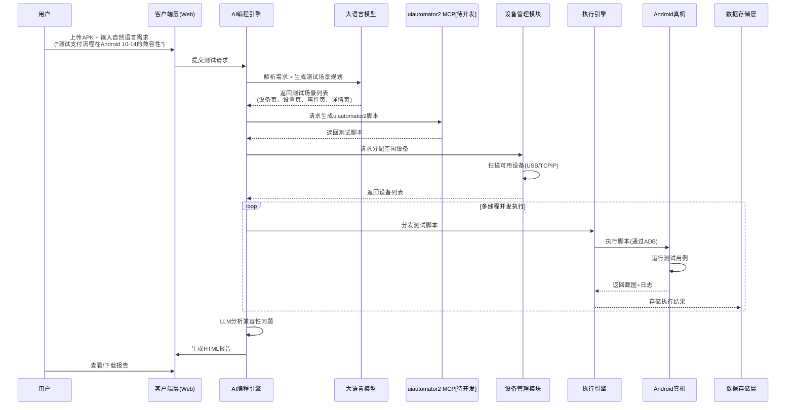

# Android兼容性测试Agent技术架构方案

## 一、方案核心目标

通过 AI 驱动的自动化测试架构，实现 Android 多机型兼容性测试（UI 错乱、崩溃、功能异常检测），以自然语言交互降低使用门槛，生成python+uiautomator2脚本，输出标准化 HTML 报告，平衡成本、效率与扩展性。

***

## 二、两大技术架构方案（完整模块 + 交互逻辑）

### 方案一：本地部署兼容性测试 Agent 平台架构

#### 1. 整体架构图（模块联动逻辑）

```
【客户端层】→ 【核心服务层】→ 【执行层】→ 【数据存储层】

（Web/桌面端）（AI+调度核心）（真机集群） （本地存储）
```

#### 2. 分层模块详解

| 架构分层  | 核心模块      | 技术选型                               | 核心职责                                  |
| ----- | --------- | ---------------------------------- | ------------------------------------- |
| 客户端层  | 交互界面模块    | faskapi（后 端）+ 静态 HTML 预览           | 提供 APK 上传、测试需求输入、设备状态查看、报告下载入口，支持静态预览 |
| 核心服务层 | AI 编程引擎模块 | LLM + Prompt 工程 + uiautomator2 MCP | 解析测试需求→自主规划兼容性测试场景→生成 uiautomator2 脚本 |
| 核心服务层 | 设备管理模块    | ADB + 多线程调度 + TCP/IP 连接管理          | 扫描局域网真机→状态监控（空闲/执行中/异常）→设备分配/释放       |
| 核心服务层 | 自动化执行引擎模块 | uiautomator2 + 线程池 + 并发控制          | 执行测试脚本→多真机并发控制→截图/日志采集→异常捕获           |
| 核心服务层 | 结果分析模块    | LLM + 图像识别算法                       | 分析截图/日志→识别兼容性问题→生成修复建议                |
| 执行层   | 真机集群模块    | Android 真机（覆盖 Android 9-14）        | 接收执行指令→运行测试用例→返回执行结果                  |
| 数据存储层 | 本地存储模块    | 文件夹分类存储 + SQLite（元数据）              | 存储 APK、测试脚本、日志、截图、报告文件                |
| 输出层   | 报告生成模块    | Python HTML 模板引擎                   | 汇总测试数据→生成标准化 HTML 报告（含问题明细+截图+建议）     |

#### 3. 核心数据流（详细实现路径）



**详细流程说明：**

1. **自然语言输入阶段**：用户通过 Web 界面上传 APK 文件并输入自然语言测试需求（如 "测试首页进入直播间兼容性"）
2. **AI 解析阶段**：
   - AI 编程引擎调用 LLM 进行需求解析
   - LLM 分析需求，自主规划测试场景（如设备页、设置页、事件页、详情页）
   - 生成结构化测试计划
3. **脚本生成阶段**：
   - AI 编程引擎调用 **uiautomator2 MCP 工具**\[待开发]
   - 根据测试场景生成适配多机型的 uiautomator2 测试脚本
   - 脚本包含元素定位、操作序列、截图时机、异常捕获逻辑
4. **设备分配阶段**：
   - 设备管理模块扫描局域网内可用真机
   - 支持两种连接方式：**ADB USB 连接** 和 **ADB TCP/IP 连接**
   - 根据测试需求分配最优设备组合
5. **并发执行阶段**：
   - 执行引擎通过线程池实现多设备并发测试
   - 实时采集执行日志和截图
   - 处理设备异常断开、执行超时等边界情况
6. **结果分析阶段**：
   - LLM 分析截图和日志，识别 UI 错乱、崩溃、功能异常
   - 生成问题明细和修复建议
7. **报告生成阶段**：汇总数据，生成标准化 HTML 测试报告

#### 4. 真机连接方案（技术难点详解）

| 连接方式              | 技术实现                                                       | 优点                    | 缺点                 | 适用场景            |
| ----------------- | ---------------------------------------------------------- | --------------------- | ------------------ | --------------- |
| **ADB USB 连接**    | USB 数据线直连，ADB 驱动识别                                         | 稳定性高、传输速度快、无需网络配置     | 物理线缆限制、设备摆放受限      | 固定测试环境、高稳定性要求场景 |
| **ADB TCP/IP 连接** | 同一局域网内通过 IP 连接（`adb tcpip 5555` + `adb connect <IP>:5555`） | 无线连接、设备摆放灵活、便于大规模集群管理 | 依赖网络稳定性、首次需 USB 配对 | 分布式真机集群、自动化测试环境 |

**多线程并发技术难点与解决方案：**

| 技术难点     | 解决方案             |
| -------- | ---------------- |
| ADB 端口冲突 | 每个设备分配独立端口，端口池管理 |
| 并发资源竞争   | 设备状态锁机制，执行引擎线程隔离 |
| 日志采集冲突   | 每个设备独立日志文件，异步写入  |
| 执行超时控制   | 独立超时定时器，强制回收设备资源 |

#### 5. uiautomator2 MCP 工具设计（待开发）

**MCP 工具核心能力：**

- **脚本生成**：根据测试场景生成标准 uiautomator2 脚本
- **元素定位**：支持 ID、XPath、文本、坐标等多种定位方式
- **操作封装**：点击、滑动、输入、等待、截图等常用操作封装
- **兼容性适配**：自动适配不同 Android 版本的 API 差异
- **异常处理**：内置元素超时、设备断开等异常处理逻辑

**MCP 工具调用流程：**

```
测试场景 → MCP工具 → uiautomator2脚本 → 执行引擎 → 真机执行
```

#### 6. 兼容性测试检测范围

| 检测页面     | 检测内容                      | 检测方法           |
| -------- | ------------------------- | -------------- |
| **设备页**  | UI 布局错乱、控件重叠、文字截断         | 截图对比 + AI 图像识别 |
| **设置页**  | 功能按钮响应异常、页面卡顿、崩溃          | 日志分析 + 执行状态监控  |
| **事件页**  | 事件触发异常、状态同步失败、数据展示错误      | 日志分析 + 结果校验    |
| **详情页**  | 图片加载失败、布局变形、交互无响应         | 截图对比 + 操作反馈检测  |
| **通用检测** | ANR（应用无响应）、Crash（崩溃）、内存泄漏 | 日志分析 + 性能监控    |

#### 7. 本地部署 vs 云部署对比分析

| 对比维度      | 本地部署方案              | 云部署方案                |
| --------- | ------------------- | -------------------- |
| **成本**    | 低（专属测试笔记本电脑）        | 高（云服务器/带宽持续费用）       |
| **性能**    | 内网低延迟（ms级），不受公网波动影响 | 受网络延迟影响，并发性能受限于云服务配置 |
| **安全性**   | 全链路数据本地流转，避免敏感数据泄露  | 数据需上传云端，存在合规风险       |
| **可靠性**   | 依赖本地测试专属笔记本，需自行维护   | 云服务商保障高可用，但依赖网络      |
| **扩展性**   | 硬件扩展需采购，软件扩展灵活      | 弹性伸缩，但受云服务限制         |
| **运维复杂度** | 测试兼职运维              | 云服务商提供运维支持或公司运维支持    |
| **适用场景**  | 物联网+APP应用场景         | 轻量测试、跨地域协作场景         |

**云部署主要缺陷：**

- 数据安全风险：APK、测试日志、截图等敏感数据需上传云端
- 网络依赖：公网波动可能导致测试中断或延迟
- 成本不可控：长期规模化测试会产生高额云服务费用
- 网络运维：需要内网开放公网，穿透的网络配置，运维成本高

**本地部署核心优势：**

- 数据安全：全链路本地化，符合高隐私等级要求
- 性能稳定：内网低延迟，测试结果可靠
- 成本可控：一次性硬件投入，无持续费用
- 定制灵活：支持深度二次开发和定制化

#### 8. 适用场景

- 中小型测试团队、长期规模化兼容性测试需求；
- 需自定义测试流程及报告格式的企业级需求；
- 当前已实现的静态 HTML 交互可作为方案预览效果。

***

### 方案二：Trae IDEA 集成 Agent+MCP 服务架构

#### 1. 整体架构图（插件化联动逻辑）

```
【Trae IDEA客户端】→ 【插件核心层】→ 【本地服务层】→ 【执行终端】

（开发/测试工具）  （Agent+解析核心）  （MCP服务）  （本地真机）
```

#### 2. 分层模块详解

| 架构分层  | 核心模块          | 技术选型                       | 核心职责                           |
| ----- | ------------- | -------------------------- | ------------------------------ |
| 客户端层  | Trae IDEA     | 原生AI开发工具                   | 自然语言需求输入、真机连接配置、脚本预览、报告查看      |
| 插件核心层 | AI Agent 模块   | Trae 内置 AI 引擎（自然语言理解+代码生成） | 解析自然语言需求→映射兼容性测试场景→生成自动化脚本     |
| 插件核心层 | 脚本解析与优化模块     | Python 语法校验器 + 自动化脚本模板库    | 优化生成脚本（适配多机型）→语法校验→格式标准化       |
| 本地服务层 | MCP（设备连接服务）   | 本地 Socket 服务 + ADB 封装（USB） | 一键连接本地真机→设备状态监控→测试指令下发         |
| 本地服务层 | 执行调度模块        | 单线程                        | 脚本执行控制→进度反馈→异常中断处理             |
| 执行终端  | 本地 Android 真机 | 支持 USB 连接的 Android 设备      | 接收脚本指令→执行测试→回传执行结果             |
| 输出层   | 报告生成模块        | 内置 HTML 模板 + 数据可视化组件       | 汇总测试结果→生成轻量化 HTML 报告（含问题截图+日志） |

#### 3. 核心数据流

1. 用户在 Trae IDEA 中输入自然语言测试需求（如 "测试 APP 首页在 Android 10-14 的兼容性"）；
2. AI Agent 模块解析需求，生成适配 uiautomator2 的测试脚本；
3. MCP 服务通过 **ADB USB** 连接本地真机，执行调度模块推送脚本；
4. 真机执行测试，实时回传执行状态、截图及日志；
5. 报告模块自动生成 HTML 报告，在插件界面展示。

#### 4. 方案局限性分析

| 局限点        | 具体表现                 | 影响              |
| ---------- | -------------------- | --------------- |
| **脚本管理困难** | 脚本分散存储在本地，无统一版本管理    | 团队协作困难，脚本复用率低   |
| **环境碎片化**  | 每个开发者/测试人员独立环境，配置不一致 | 测试结果不可重现，问题定位困难 |
| **并发能力有限** | 不支持                  | 无法满足规模化测试需求     |
| **扩展能力弱**  | 依赖插件内置能力，自定义开发受限     | 难以适配复杂业务场景      |
| **数据安全性**  | 数据存储在本地，无统一备份机制      | 测试数据易丢失         |

#### 5. 定位与适用场景

**方案定位：个人备选调试方案**

- 适合开发人员快速验证单个功能的兼容性；
- 适合临时、小规模的兼容性抽检；
- 作为方案一的补充，满足快速调试需求。

**适用场景：**

- 小型团队、创业公司（无专职测试团队）；
- 快速迭代项目的兼容性抽检（如新版本上线前快速验证）；
- 开发人员自测兼容性、产品经理自助验证功能适配；
- 不适合长期规模化、高并发、高安全要求的测试场景。

***

## 三、架构方案对比与选型建议

| 对比维度  | 方案一：本地部署 AI 测试 Agent 平台 | 方案二：Trae IDEA 集成 Agent+MCP 服务 |
| ----- | ----------------------- | ----------------------------- |
| 架构复杂度 | 中（分层模块设计，需本地服务器支撑）      | 低（插件化架构，依赖 IDE 生态）            |
| 部署成本  | 中（需配置本地服务器+真机集群）        | 低（仅需安装trae+mcp+少量真机）          |
| 并发能力  | 高（支持 10+ 真机并发执行）        | 低（支持 1-3 台真机并行）               |
| 定制化能力 | 强（模块可二次开发，支持自定义规则）      | 弱（依赖插件内置能力，扩展有限）              |
| 数据安全  | 高（全链路本地流转）              | 中（本地存储，无统一安全管控）               |
| 脚本管理  | 完善（统一版本管理、脚本库）          | 薄弱（分散存储，无版本控制）                |
| 团队适配  | 适合有技术维护能力的测试团队          | 适合无专业测试团队的小型项目                |
| 定位    | 主生产方案                   | 个人备选调试方案                      |

### 选型建议

1. **主生产方案选择**：若需长期规模化、高定制化、高并发的兼容性测试，且关注数据安全→ **选择方案一**；
2. **辅助方案选择**：若需轻量化、低门槛、快速验证的兼容性测试，作为个人调试使用→ **选择方案二**；
3. **混合场景**：核心项目使用方案一进行规模化测试，开发人员使用方案二进行日常调试，两种架构互补增效。

***

## 四、关键技术依赖与待开发项

| 依赖项                 | 状态  | 说明                            |
| ------------------- | --- | ----------------------------- |
| uiautomator2 MCP 工具 | 待开发 | 实现脚本生成、元素定位、操作封装等核心能力         |
| 并发执行引擎              | 待开发 | 支持多设备并行测试、资源调度、异常处理           |
| 设备管理模块              | 待开发 | 支持 USB/TCPIP 双模式连接、状态监控、设备池管理 |
| AI 结果分析模块           | 待开发 | LLM 日志分析、图像识别、问题分类            |
| 静态 HTML 预览界面        | 已实现 | 可作为方案效果预览                     |

***

## 附录：参考演示案例

以下为同类 AI 驱动 Android 自动化测试方案的公开演示案例，可作为本方案效果的参考：

### 1. DroidBot

- **地址**：<https://joe-qai.github.io/DroidBot/>
- **简介**：AI 驱动的 Android 自动化测试工具，支持自然语言生成测试脚本、多设备并发执行、UI 兼容性检测
- **参考价值**：展示了 AI 与 uiautomator2 结合的可行性，提供了类似的技术实现思路

### 2. 飞书妙搭 Demo

- **地址**：<https://sd6syw7aku.aiforce.cloud/app/app_4k4a3yhc4ueev>
- **简介**：基于飞书妙搭平台搭建的移动端测试自动化应用，支持自然语言交互、测试脚本生成、真机测试执行
- **参考价值**：展示了低代码平台与 AI 测试能力的集成方式，可作为方案二（Trae IDEA 集成）的参考实现

